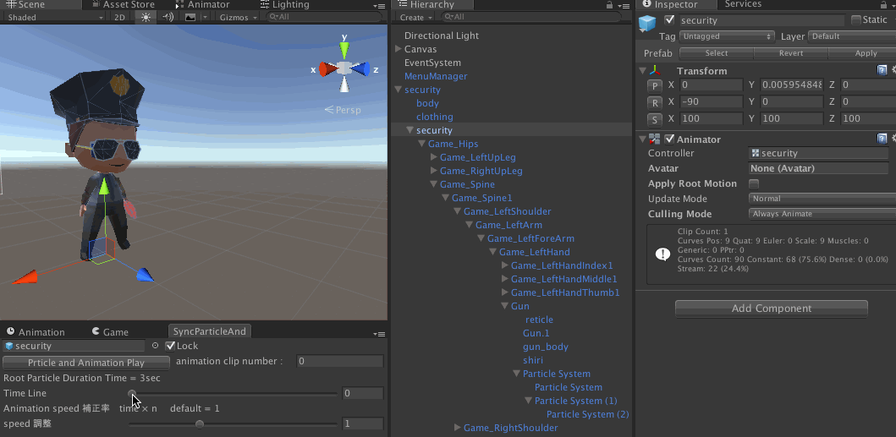
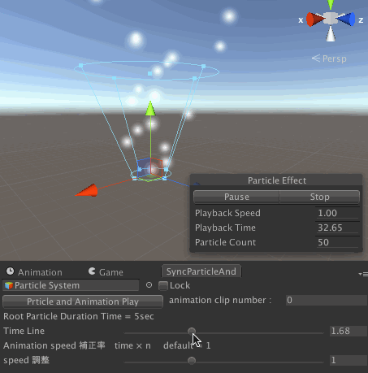
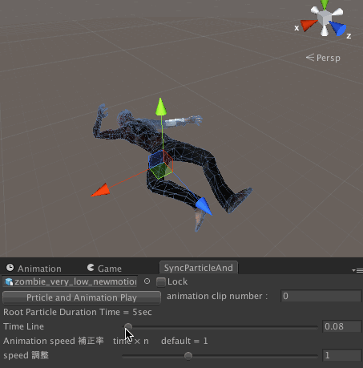
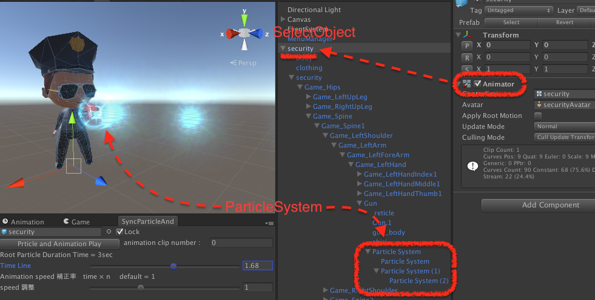

# SyncParticleAndAnimationEditor
Unity Editor非再生時に、ParticleSystem(shuriken)とAnimationClipを同時再生させます。  


### 使いかた usage
- Unityメニュー > window > SyncParticleAndAnimationEditor を選択し、windowを開きます。
- Hierarchy上で、ParticleSystemと Animator(もしくはAnimation)がついてるgameObjectを選択します。
- Time Line　のsliderを動かします。
- sliderのvalueに応じてAnimationClipとParticleSystemがvalue時間でsimulateされます。
- animation clip number を変えることで、simulateするAnimationClipを変更できます。
|ParticleSystem|Animator or Animation|
|---|---|
|||

### Speed調整
- Unityを非再生時にはAnimationClipのspeedが早かったり遅かったりします。
- その場合はSpeed調整スライダーを動かして調整してください。

### Hierarchyに関して
- rootとなるgameObjectを選択していれば、子階層にあるAnimatorやParticleSystemも同時に再生されます。


### 問題点
- Unity5で動きます。
- Unity4では、Animatorの再生部分でエラーになりますが、
  エラー箇所をコメントアウトすれば動きます。  
  ですがその場合、Animatorは機能しません。
```C#
	/// <summary>
	/// Animator依存のAnimationClipをシュミレートする
	/// </summary>
	/// <param name="time">Simulate Time.</param>
	void PlayAnimator (float time)
	{
		foreach (var animator in animatorsList) {
			var ctl = animator.runtimeAnimatorController;
        // unity4なら↓をコメントアウト
		//	if (ctl.animationClips.Length > 0) {
		//		ctl.animationClips [clipNumber].SampleAnimation (selectObjects [0], time);
		//	}
		}
	}
```

- ParticleSystemでstartDelayが設定されている場合、表示されない場合があります。  
  （lifeTimeが短い場合など）
- EmissionをDistance設定されているものは、描画されないものがあります。